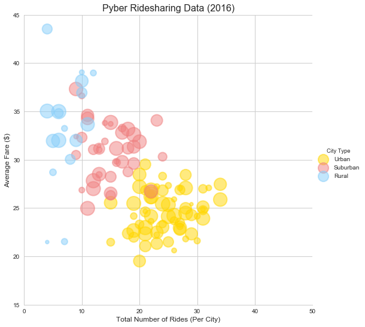
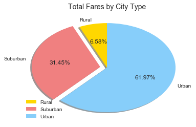
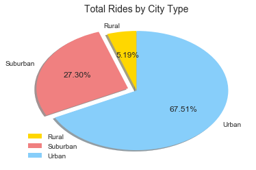
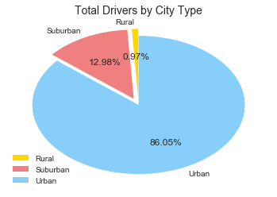

# Pyber Data Analysis (2016)


```python
# import libraries
import pandas as pd
import matplotlib.pyplot as plt
import seaborn as sns 
```


```python
#-------------------------------
# Step 1: Read in and clean data file 
#-------------------------------

# create dataframes to hold the data
city_df = pd.read_csv('data/city_data.csv').dropna()
rides_df = pd.read_csv('data/ride_data.csv').dropna()

# create a merged dataframe, excluding any cities that we don't have complete data on
cityPlusRides_df = city_df.merge(rides_df, on='city', how='left')
```


```python
#-------------------------------
# Step 2: Generate bubble plot 
#-------------------------------

# x: count of rides per city
x_list = cityPlusRides_df.groupby(by='city')['ride_id'].count()
# y: average fare in each city
y_list = round(cityPlusRides_df.groupby(by='city')['fare'].mean(),2)
# z: driver count for each city
z_list = cityPlusRides_df.drop_duplicates(subset='city', keep='first').set_index('city')['driver_count']*8
# color: based on the type for each city
type_list = cityPlusRides_df.drop_duplicates(subset='city', keep='first').set_index('city')['type']

# create dataframe to work with
bubbleData_df = pd.DataFrame({'x':x_list,'y':y_list,'z':z_list,'City Type':type_list})

# create color list
color_list = {'Urban':'gold', 'Suburban':'lightcoral', 'Rural':'lightskyblue'}

# create scatterplot
sns.set(style='whitegrid', context='notebook')
bubblePlot=sns.lmplot(x='x', y='y', data=bubbleData_df, hue='City Type', palette=color_list,\
                      fit_reg=False, size=7.5,\
                      legend=True,legend_out=True,\
                      scatter_kws={'s':z_list, 'alpha':0.5, 'edgecolors':'face', 'linewidths':2})
plt.xlim(0,50)
plt.ylim(15,45)
plt.title("Pyber Ridesharing Data (2016)",{'fontname':'Arial','fontsize':16})
plt.xlabel("Total Number of Rides (Per City)",{'fontname':'Arial','fontsize':12})
plt.ylabel("Average Fare ($)",{'fontname':'Arial','fontsize':12})
plt.show()
```





The clear majority of our rides and drivers are in the urban cities. However, the urban rides seem to consistently result a lower average fare than rides in suburban or rural cities.

## Total Fares by City Type
The majority of our revenue comes from our urban clientele, with 61.97%. However, at 31.45%, our suburban customers still account for a significant portion of our fare revenue, since they have, on average, consistently higher average fares.


```python
#---------------------------------------------
# Step 3: Generate fare by city type pie chart
#---------------------------------------------

# create dataframe
fareByCity_df = pd.DataFrame(cityPlusRides_df.groupby(by='type')['fare'].sum())

# create labels, wedge slices, colors, explode
labels = ['Rural', 'Suburban', 'Urban']
wedge_sizes = [fareByCity_df['fare'][0]/fareByCity_df['fare'].sum(),\
               fareByCity_df['fare'][1]/fareByCity_df['fare'].sum(),\
               fareByCity_df['fare'][2]/fareByCity_df['fare'].sum()]
colors = ['gold', 'lightcoral', 'lightskyblue']
explode = (0, 0.1, 0)

# create and display pie chart
fig1, ax1 = plt.subplots()
ax1.pie(wedge_sizes, labels=labels, autopct='%1.2f%%', startangle=90,\
        colors=colors, explode=explode, shadow=True)
ax1.axis('off')
plt.legend(loc='lower left')
plt.title("Total Fares by City Type",{'fontname':'Arial','fontsize':14})
plt.show()
```





## Total Rides by City Type


```python
#---------------------------------------------
# Step 4: Generate rides by city type pie chart
#---------------------------------------------
# create dataframe
ridesByCity_df = pd.DataFrame(cityPlusRides_df.groupby(by='type')['ride_id'].count())

# create labels, wedge slices, colors, explode
labels = ['Rural', 'Suburban', 'Urban']
wedge_sizes = [ridesByCity_df['ride_id']['Rural']/ridesByCity_df['ride_id'].sum(),\
               ridesByCity_df['ride_id']['Suburban']/ridesByCity_df['ride_id'].sum(),\
               ridesByCity_df['ride_id']['Urban']/ridesByCity_df['ride_id'].sum()]
explode = (0, 0.1, 0)

# create and display pie chart
fig1, ax1 = plt.subplots()
ax1.pie(wedge_sizes, labels=labels, autopct='%1.2f%%',\
        startangle=90, colors=colors, explode=explode, shadow=True)
ax1.axis('off')
plt.legend(loc='lower left')
plt.title("Total Rides by City Type",{'fontname':'Arial','fontsize':14})
plt.show()
```





## Total Drivers by City Type
The vast majority of our drivers are located in urban cities. However, given that in suburban cities, even with fewer overall drivers, we are able to generate a non-negligible amount of revenue, it would be worth doing further analysis to see if increasing coverage in our suburban cities would lead to increased revenue without increasing overhead, having drivers idling, or risking our overall customer experience.


```python
#---------------------------------------------
# Step 5: Generate drivers by city type pie chart
#---------------------------------------------
# create dataframe
driversByCity_df = pd.DataFrame(cityPlusRides_df.groupby(by='type')['driver_count'].sum())

# create labels, wedge slices, colors, explode
labels = ['Rural', 'Suburban', 'Urban']
wedge_sizes = [driversByCity_df['driver_count']['Rural']/driversByCity_df['driver_count'].sum(),\
               driversByCity_df['driver_count']['Suburban']/driversByCity_df['driver_count'].sum(),\
               driversByCity_df['driver_count']['Urban']/driversByCity_df['driver_count'].sum()]
explode = (0.1, 0.1, 0)

# create and display pie chart
fig1, ax1 = plt.subplots()
ax1.pie(wedge_sizes, labels=labels, autopct='%1.2f%%', startangle=90, colors=colors, explode=explode)
ax1.axis('off')
plt.legend(loc='lower left')
plt.title("Total Drivers by City Type",{'fontname':'Arial','fontsize':14})
plt.show()
```




